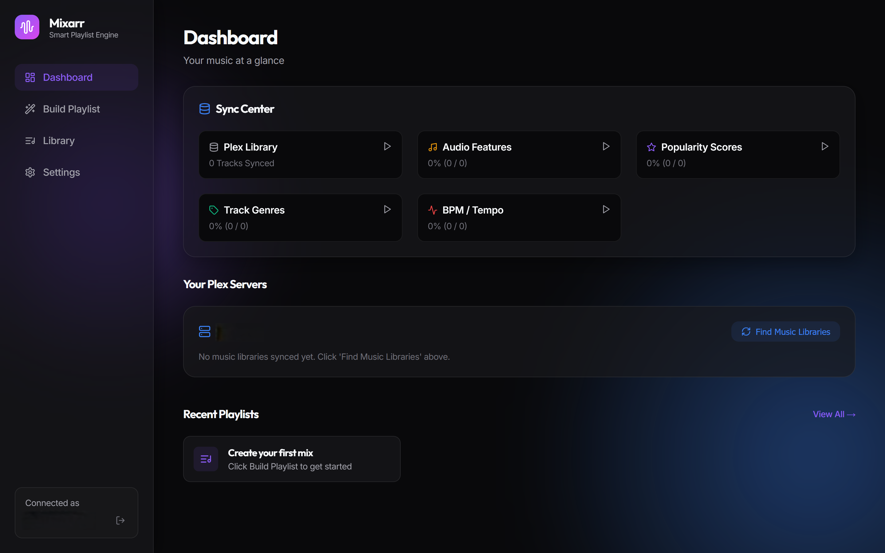
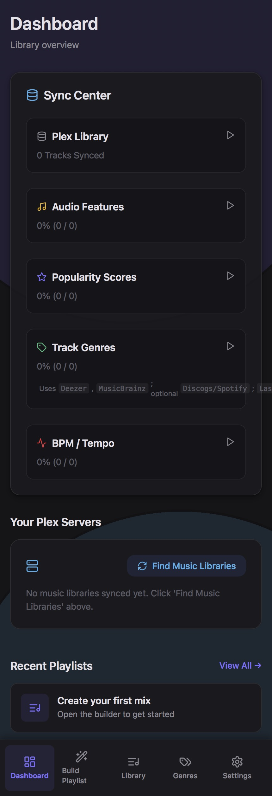
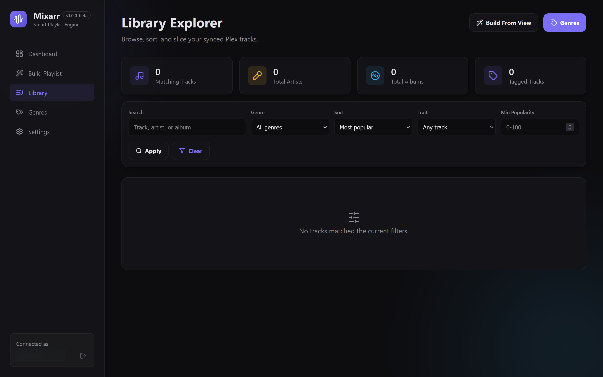
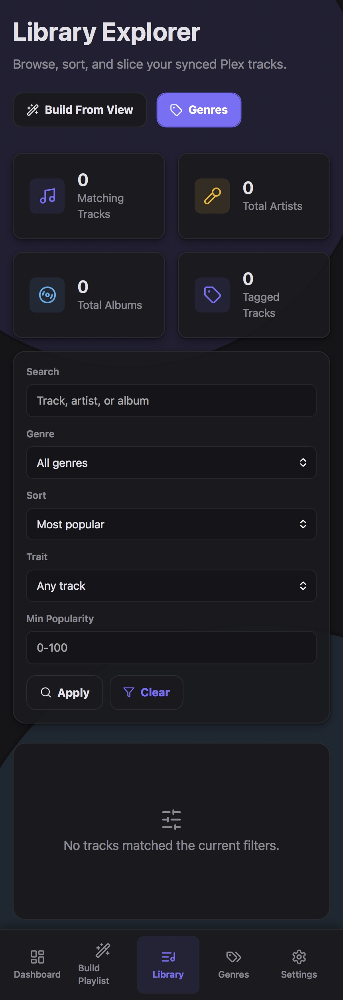
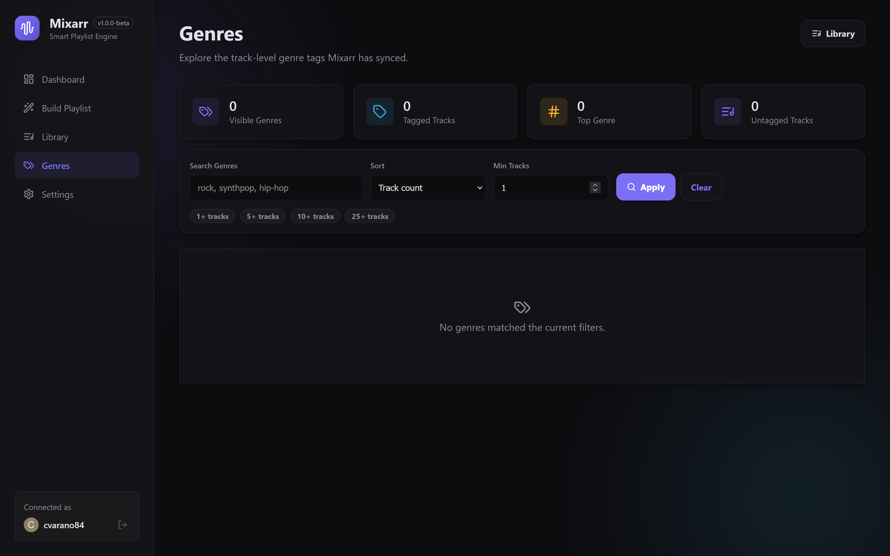
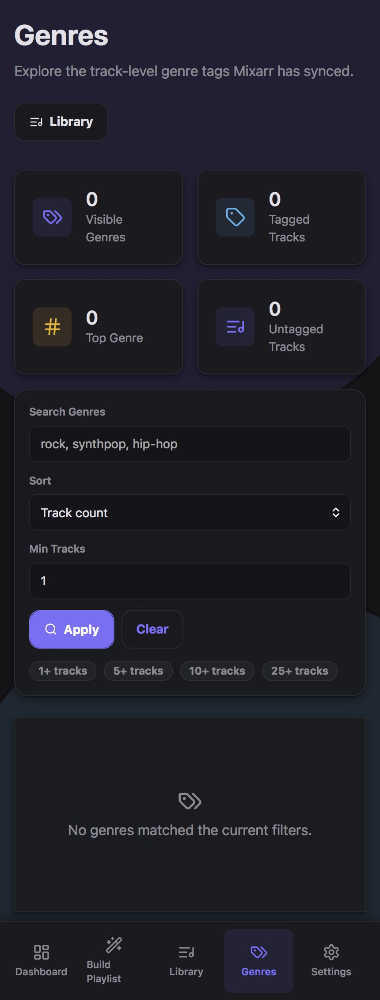
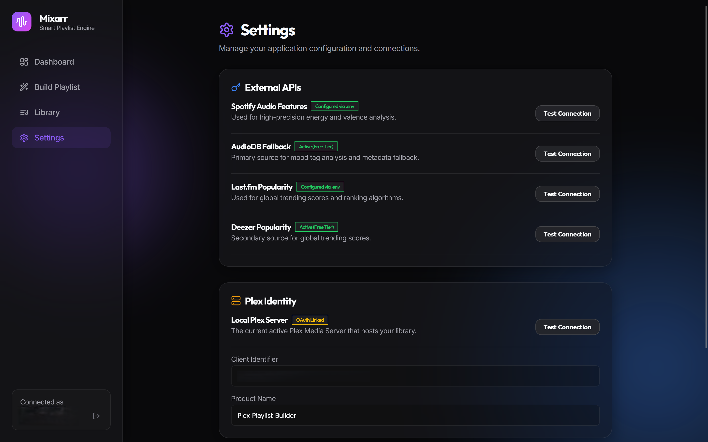
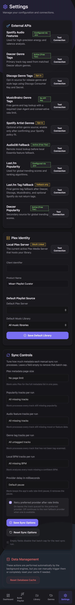

# Mixarr - Smart Playlist Engine

**Mixarr** is a fully containerized, autonomous, and incredibly powerful Smart Playlist Engine for your Plex Media Server. Designed to bring dynamic, vibe-based mixes to your self-hosted music library.



## Features

- **Blazing Fast Local Cache**: Mixarr autonomously syncs your entire Plex music library (Artists, Albums, Tracks, and Tags) into a local PostgreSQL database, enabling instant query times across tens of thousands of tracks.
- **Smart Metadata Enrichment**: 
  - Analyzes the "feel" of your music by mapping raw data into **Energy (0.0-1.0)**, **Valence/Mood (0.0-1.0)**, and exact **BPM (Tempo)** scores using **AudioDB** and **Deezer**.
  - Backfills missing BPM locally by preferring **Essentia** on supported amd64 Docker hosts, with **Aubio** retained as an automatic fallback for ARM64 or unavailable Essentia installs.
  - Calculates global **Popularity** scores using **Last.fm** and **Deezer**.
  - Enriches track genre tags through **Deezer**, **MusicBrainz**, opt-in **Discogs**/**Spotify**, and **Last.fm** only as the final fallback.
- **Dynamic Rule Builder**: Create complex queries instantly. Find tracks where `Genre CONTAINS "Rock"`, `Energy > 0.8`, and `Popularity < 40`—all processed entirely locally.
- **Push to Plex**: Seamlessly export your generated mixes straight back to your Plex Media Server.
- **Premium UI / UX**: A gorgeous "Glassmorphic" interface powered by Next.js, featuring an animated floating mesh gradient, crisp typography (Google Inter & Outfit), and satisfying micro-animations.
- **Native Mobile Experience**: 100% responsive design. On mobile devices, the app seamlessly morphs into a mobile layout with a fixed bottom navigation bar, making it perfectly usable on the go.

## Previews

### Dashboard
| Desktop | Mobile |
| :---: | :---: |
|  |  |

### Playlist Builder
| Desktop | Mobile |
| :---: | :---: |
|  |  |

### Library View
| Desktop | Mobile |
| :---: | :---: |
|  |  |

### Genres Page
| Desktop | Mobile |
| :---: | :---: |
|  |  |

### Settings & Integration
| Desktop | Mobile |
| :---: | :---: |
|  |  |

## Getting Started

1. Clone this repository.
2. Duplicate `.env.example` to `.env` and fill in your API keys (Plex Client Identifier, Discogs/Last.fm/Spotify as needed).
   - Local BPM analysis defaults to `LOCAL_BPM_ANALYZER=auto`, which uses Essentia's BPM-focused `RhythmExtractor2013` when available and logs when it falls back to Aubio. BPM and Audio Feature providers can be controlled from Settings or with `ENABLE_API_BPM`, `ENABLE_LOCAL_BPM`, `PREFER_LOCAL_BPM`, `ENABLE_API_AUDIO_FEATURES`, `ENABLE_LOCAL_AUDIO_FEATURES`, and `PREFER_LOCAL_AUDIO_FEATURES`; disabling an API provider prevents calls for that category, and disabling local analysis prevents Essentia work. Samples are written atomically and must pass size, audio-stream, and duration checks through ffprobe before analysis. Use `LOCAL_BPM_ANALYSIS_SCOPE=whole_track` for slower full-track BPM analysis, or keep the default `windows` mode for multi-window analysis. Local Essentia audio-feature fallback also supports `LOCAL_AUDIO_FEATURES_SCOPE=whole_track`; the default `windows` mode analyzes 30s-90s, the middle window, and the last-third window. Tracks below `LOCAL_AUDIO_FEATURES_MIN_DURATION_SECONDS` (default `10`) are marked `too_short` instead of extraction-failed; whole-track analysis can opt into 5-10 second tracks with `LOCAL_AUDIO_FEATURES_ALLOW_SHORT_TRACKS=true`. Automatic initial enrichment does not launch the large local Essentia audio-feature backfill unless `LOCAL_AUDIO_FEATURES_AUTO_BACKFILL=1`, except when API audio features are disabled and local analysis is enabled. To avoid Plex transcode failures in Docker, mount your media into the app container and set `PLEX_MEDIA_PATH_HOST` plus `MIXARR_MEDIA_PATH_CONTAINER`, or `MIXARR_PATH_MAPPINGS=/mnt/media:/media,/data:/data`. The mapping rewrites the path Plex reports; the Compose volume mounts the real Docker host folder. For example, if Plex reports `/mnt/Music/...` but the Docker host stores files at `/mnt/plex/Music/...`, use `MIXARR_PATH_MAPPINGS=/mnt/Music:/media` and mount `/mnt/plex/Music:/media:ro`. Set `LOCAL_BPM_REPROCESS_NO_DATA_FAILED=1`, or enable the matching Sync Options checkbox, to retry tracks previously marked as BPM no-data, extraction-failed, or analyzer-failed.
3. Spin up the entire stack using Docker:

```bash
docker-compose up -d --build
```

4. Navigate to `http://localhost:3000` to begin syncing your library.

## Database and Job Tuning

Mixarr keeps Prisma traffic conservative by default: background DB work is bounded with `MIXARR_DB_JOB_CONCURRENCY=4`, `/api/sync/status` is cached briefly with `MIXARR_STATUS_CACHE_SECONDS=5`, active sync polling defaults to `MIXARR_STATUS_POLL_SECONDS=10`, and idle polling defaults to `MIXARR_STATUS_IDLE_POLL_SECONDS=30`.

If a larger install still needs more room, Prisma supports connection-string parameters such as `connection_limit` and `pool_timeout`, for example:

```env
DATABASE_URL=postgresql://mixarr:mixarrpass@db:5432/mixarrdb?schema=public&connection_limit=20&pool_timeout=20
```

Prefer lowering job concurrency and avoiding overlapping syncs before raising the pool size.

## Architecture

- **Frontend**: Next.js 14 App Router, React, Vanilla CSS (Glassmorphism + Animations)
- **Backend**: Next.js Serverless Routes, Node.js background workers (SyncEngine)
- **Database**: PostgreSQL mapped with Prisma ORM
- **Containerization**: Docker & Docker Compose

## Future Features

- **Ideas**: Have and idead for a future fearture 'https://www.reddit.com/r/Softwarr/comments/1tbfb0r/plexmix_smart_playlist_builder_for_plex/' leave a comment with your ideas.
- **Multiple Tracks**: Will add functionality to allow for albums that have the same song from the same artist to only have one track show up in the playlist. might alsom have a settings toggle.
- **Discord**: will start a discord server if there is interest. Be a good way to provided feature ideas, get suggestions, and have feedback
